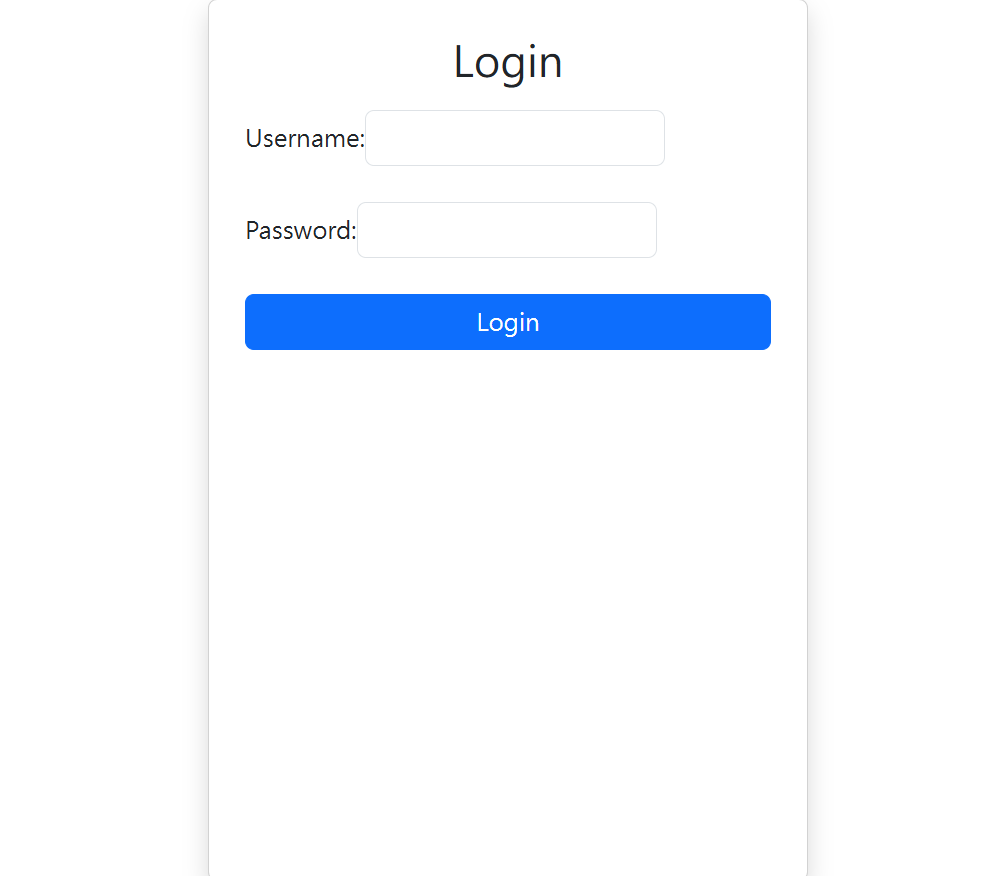

# Ticket Management System (PHP + MySQL)

## Overview
This is a simple ticket management system built using PHP and MySQL.

It allows users to create and manage support tickets, while admin users can update and delete tickets.

## Features
- User login system (with password hashing)
- Session-based authentication
- Create ticket
- View tickets
- Admin panel
- Update ticket status
- Delete ticket
- Role-based access control (Admin / User)

## Tech Stack
- PHP
- MySQL
- Bootstrap
- XAMPP

## What I Learned
- Authentication system (login & session)
- CRUD operations (Create, Read, Update, Delete)
- Role-based access control
- Backend + frontend integration

## Screenshots
### Lgoin Page


### Admin Page


### View data Page


## 🚀 Demo Flow

1. User login
2. Create ticket
3. View tickets
4. Admin manage tickets
5. Update or delete ticket

## 💡 Key Highlights

- Implemented full CRUD system
- Designed role-based access control (Admin / User)
- Built authentication system using password hashing
- Developed UI with Bootstrap for better usability

## Project Structure
```text
ticket-system/
├── public/
├── auth/
├── config/
├── images/
└── other/


